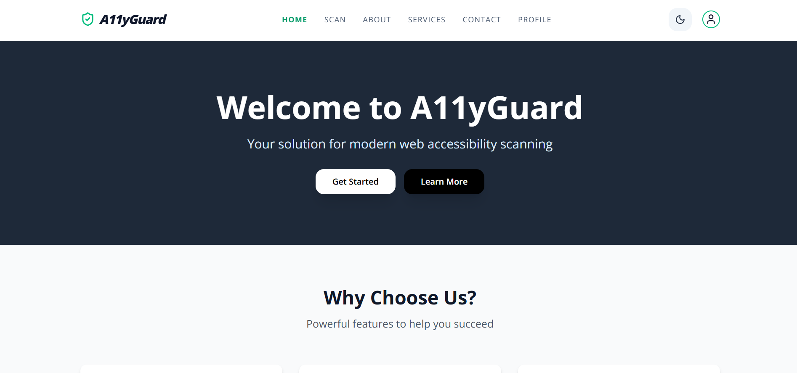

# A11yGuard



A11yGuard is a high-performance, dockerized web application built with Next.js and Puppeteer. It empowers developers to scan public websites in real-time for accessibility gaps, leveraging the industry-standard axe-core engine to provide actionable, WCAG-compliant insights through a sleek and intuitive dashboard.

## What This Project Does Today

- Scans a target URL for accessibility violations using `@axe-core/puppeteer`
- Returns structured scan results with issue details and severity summary
- Supports user authentication with NextAuth
- Supports both email/password login and Google OAuth login
- Protects private pages using middleware-style route checks
- Lets authenticated users view and update their profile
- Supports profile image upload to Cloudinary
- Includes responsive pages for Home, About, Services, Contact, Scan, Login, Register, and Profile
- Supports light/dark theme toggle

## Tech Stack

- Framework: Next.js 16 (App Router)
- Language: TypeScript
- UI: React 19 + Tailwind CSS 4
- Authentication: NextAuth
- Database: MongoDB + Mongoose
- Accessibility scanning: axe-core + puppeteer-core
- File upload: Cloudinary
- Notifications: react-hot-toast

## Main Routes

### App Pages

- `/`
- `/about`
- `/services`
- `/contact`
- `/scan`
- `/login`
- `/register`
- `/profile`
- `/profile/edit`
- `/scan/issue`

### API Routes

- `POST /api/scan` - Run accessibility scan for a URL
- `POST /api/auth/register` - Register a new user with email/password
- `GET /api/user` - Get authenticated user profile
- `POST /api/user/update` - Update profile data and image
- `GET/POST /api/auth/[...nextauth]` - NextAuth handler

## Setup

### 1. Install dependencies

```bash
npm install
```

### 2. Create `.env.local`

Use the exact variable names below (matching current code):

```env
# MongoDB
MONGODB_URI=your_mongodb_connection_string

# NextAuth
NEXT_AUTH_SECRET=your_nextauth_secret

# Google OAuth (optional if you only use credentials)
GOOGLE_CLIENT_ID=your_google_client_id
GOOGLE_CLIENT_SECRET=your_google_client_secret

# Cloudinary
CLOUDINARY_CLIENT_NAME=your_cloudinary_cloud_name
CLOUDINARY_API_KEY=your_cloudinary_api_key
CLOUDINARY_API_SECRET=your_cloudinary_api_secret

# Accessibility scan runtime
# Recommended for production/serverless
BROWSERLESS_TOKEN=your_browserless_token

# Optional: override Chrome binary path for scan worker
# CHROME_EXECUTABLE_PATH=/path/to/chrome
```

Notes:

- In production, scanning requires either `BROWSERLESS_TOKEN` or `CHROME_EXECUTABLE_PATH`.
- On local Windows development, the scan route tries to use local Chrome at `C:\Program Files\Google\Chrome\Application\chrome.exe` unless overridden.

### 3. Run locally

```bash
npm run dev
```

Open `http://localhost:3000`.

## NPM Scripts

```bash
npm run dev
npm run build
npm run start
npm run lint
```

## Scan API Example

### Request

```bash
curl -X POST http://localhost:3000/api/scan \
  -H "Content-Type: application/json" \
  -d '{"url":"https://example.com"}'
```

### Successful response shape

```json
{
    "url": "https://example.com",
    "scannedAt": "2026-03-15T00:00:00.000Z",
    "totalIssues": 3,
    "issuesBySeverity": {
        "high": 2,
        "medium": 1,
        "low": 0
    },
    "issues": [
        {
            "id": "abc123xyz",
            "category": "Accessibility",
            "name": "Issue title",
            "description": "Issue details",
            "severity": "High",
            "affectedElements": [""],
            "remediation": "How to fix"
        }
    ]
}
```

## Deployment Notes

- `Dockerfile`, `docker-compose.yml`, and `vercel.json` are included.
- For serverless deployments, Browserless is the expected runtime strategy for scanning.

## Repository Structure

```text
src/
  app/
    api/
      auth/
      scan/
      user/
    about/
    contact/
    login/
    profile/
    register/
    scan/
    services/
  components/
  context/
  lib/
  model/
  types/
```

## Author

Abhishek Kumar
